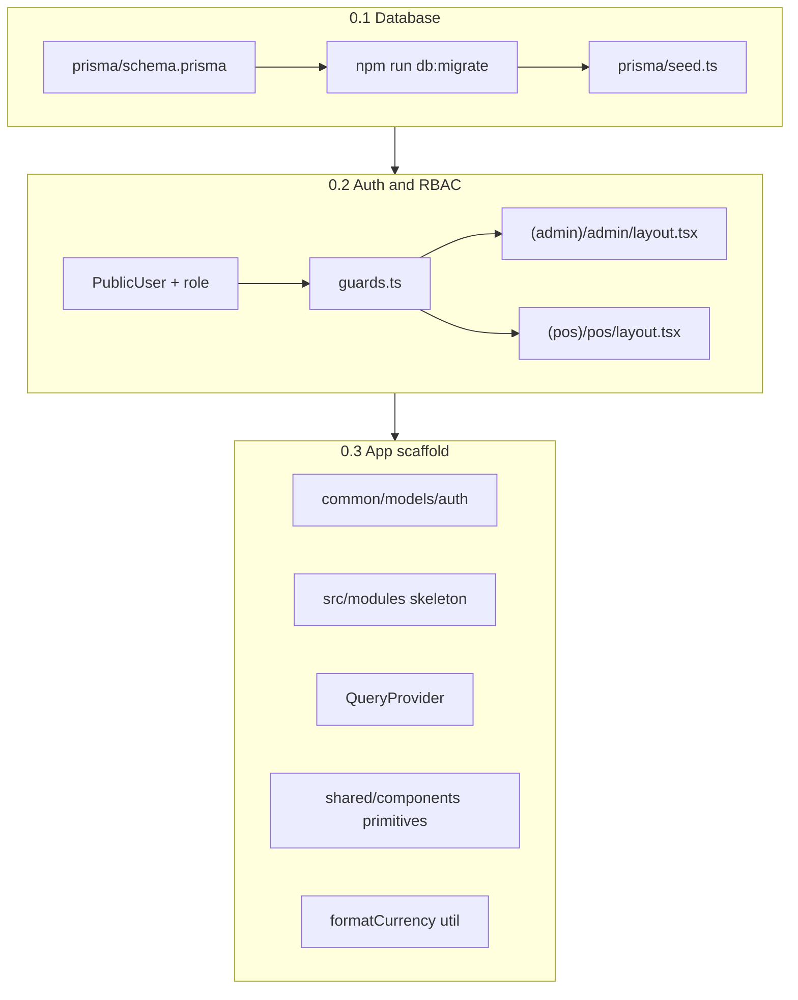
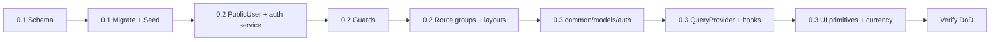

# Phase 0 — Foundation: Kế hoạch triển khai chi tiết

## Trạng thái hiện tại

| Hạng mục | Trạng thái |
|----------|------------|
| Auth API (login/register/logout/me) | Đã có — [`src/server/auth/`](src/server/auth/) |
| Prisma models | Chỉ `User`, `Session` — [`prisma/schema.prisma`](prisma/schema.prisma) |
| `PublicUser` | Thiếu `role`, `phone`, `isActive` — [`src/libs/auth/session.ts`](src/libs/auth/session.ts) |
| RBAC / route guards | Chưa có |
| Route groups `(admin)`, `(customer)`, `(pos)` | Chưa có |
| TanStack Query | Đã cài (`package.json`) nhưng chưa wire vào [`src/app/layout.tsx`](src/app/layout.tsx) |
| `common/models/` | Chưa có |
| `src/modules/` | Chưa có |
| `src/shared/components/` | Chưa có (chỉ có `utils/`, `types/`) |
| Seed script | Chưa có |

## Quyết định kiến trúc (đã chốt)

1. **RBAC:** Layout guards bằng Server Component — `getSessionUser()` + `requireRole()` trong layout, `redirect()` nếu fail. Không dùng middleware cho role check (session là opaque DB token, cần Prisma).
2. **Thư mục feature:** Tuân [`CLAUDE.md`](CLAUDE.md) + [`.cursor/rules/module-architecture.mdc`](.cursor/rules/module-architecture.mdc) — dùng `src/modules/`, **không** `src/features/` như ghi trong IMPLEMENTATION_PLAN cũ.
3. **Shared UI:** Dùng `src/shared/components/` (theo module-architecture), không `src/shared/ui/`.
4. **ShopSettings:** Không thêm ở Phase 0 — defer sang Phase 1.8.



---

## 0.1 — Database & Schema cơ bản

### 0.1.1 Cập nhật `prisma/schema.prisma`

Copy data model từ [IMPLEMENTATION_PLAN — Data Model Reference](docs/IMPLEMENTATION_PLAN.md) (dòng 459–603), **trừ `ShopSettings`**.

**Enums cần thêm:**
- `Role`: `ADMIN`, `STAFF`, `CUSTOMER`
- `ProductType`, `OrderType`, `OrderChannel`, `OrderStatus`, `PaymentMethod`, `PaymentStatus`, `FulfillmentType`

**Mở rộng `User`:**
```prisma
role     Role    @default(CUSTOMER)
phone    String?
isActive Boolean @default(true)
orders   Order[] @relation("CustomerOrders")
```

**Models mới:** `Category`, `Product`, `ProductVariant`, `Topping`, `ProductTopping`, `ProductSku`, `Order`, `OrderItem`, `OrderItemTopping`

**Lưu ý khi implement:**
- `Order.createdById` — thêm relation tới `User` (staff tạo đơn POS), ví dụ `@relation("StaffCreatedOrders")`
- `OrderItem.options` — `Json?` cho sugar/ice
- Indexes hữu ích: `Category.slug`, `Product.slug`, `Product.categoryId`, `Order.orderNumber`, `Order.status`
- `onDelete: Cascade` cho child records (variants, order items) như reference

### 0.1.2 Migration & generate

```bash
npm run db:migrate    # tên migration: add_foundation_schema
npm run db:generate
```

### 0.1.3 Seed script — `prisma/seed.ts`

**Cấu hình `package.json`:**
```json
"prisma": { "seed": "tsx prisma/seed.ts" },
"db:seed": "prisma db seed"
```

**Dữ liệu seed (idempotent — dùng `upsert` theo email/slug):**

| Entity | Nội dung |
|--------|----------|
| Users | `admin@coffee.local` (ADMIN), `staff@coffee.local` (STAFF) — password cố định dev: `Password123!` |
| Categories | ≥2 DRINK (Cà phê, Trà), ≥1 PACKAGED (Hạt cà phê) |
| Drinks | ≥3 products DRINK, mỗi product 2–3 `ProductVariant` (S/M/L + giá VND) |
| Toppings | ≥2 (Trân châu, Kem cheese) + `ProductTopping` links |
| Packaged | ≥2 products PACKAGED, mỗi product 1–2 `ProductSku` (250g/500g + stock) |

**Không seed orders** ở Phase 0 — orders test ở Phase 1+.

**Files:** [`prisma/schema.prisma`](prisma/schema.prisma), `prisma/seed.ts`, [`package.json`](package.json)

---

## 0.2 — Auth & RBAC

### 0.2.1 Mở rộng `PublicUser` + session helpers

**File:** [`src/libs/auth/session.ts`](src/libs/auth/session.ts)

```ts
export type PublicUser = Pick<User, "id" | "email" | "name" | "phone" | "role" | "isActive" | "createdAt" | "updatedAt">;
```

- Cập nhật `toPublicUser()` trả về đủ fields
- `getSessionUser()`: sau khi load user, nếu `!user.isActive` → xóa session cookie + return `null`

### 0.2.2 Cập nhật auth repository & service

**[`src/server/auth/auth.repository.ts`](src/server/auth/auth.repository.ts):**
- `createUser()` — thêm `role?: Role` (default `CUSTOMER` qua Prisma)
- Thêm `findUserById(id)` nếu guards cần

**[`src/server/auth/auth.service.ts`](src/server/auth/auth.service.ts):**
- `loginUser()` — reject nếu `!user.isActive` → `AppError("Account is disabled", 403)`
- `registerUser()` — luôn tạo `role: CUSTOMER` (explicit trong repository data)

### 0.2.3 Guards — `src/libs/auth/guards.ts` (mới)

```ts
import { redirect } from "next/navigation";
import type { Role } from "@/generated/prisma";
import { getSessionUser } from "./session";
import { AppError } from "@/libs/errors";

export async function requireAuth() {
  const user = await getSessionUser();
  if (!user) throw new AppError("Unauthorized", 401);
  return user;
}

export async function requireRole(allowed: Role[]) {
  const user = await requireAuth();
  if (!allowed.includes(user.role)) throw new AppError("Forbidden", 403);
  return user;
}

// Dùng trong layout (redirect thay vì throw)
export async function requireAuthOrRedirect(loginPath = "/auth") { ... }
export async function requireRoleOrRedirect(allowed: Role[], loginPath = "/auth") { ... }
```

- API routes dùng `requireAuth()` / `requireRole()` → catch `AppError` → `jsonError`
- Layouts dùng `*OrRedirect()` → `redirect("/auth")` hoặc `redirect("/")` tùy context

**Export từ** [`src/libs/auth/index.ts`](src/libs/auth/index.ts)

### 0.2.4 Role home redirect (sau login)

Thêm helper `getRoleHomePath(role: Role)`:
- `ADMIN` → `/admin`
- `STAFF` → `/pos`
- `CUSTOMER` → `/`

Dùng ở Phase 1+ login UI; Phase 0 có thể wire sẵn trong auth-playground hoặc để Phase 1.

### 0.2.5 Layout guards

**`src/app/(admin)/admin/layout.tsx`** (Server Component):
```ts
import { requireRoleOrRedirect } from "@/libs/auth/guards";
// requireRoleOrRedirect(["ADMIN"])
```

**`src/app/(pos)/pos/layout.tsx`**:
```ts
// requireRoleOrRedirect(["ADMIN", "STAFF"])
```

**Placeholder pages** (verify guards hoạt động):
- `src/app/(admin)/admin/page.tsx` — "Admin Dashboard (Phase 1)"
- `src/app/(pos)/pos/page.tsx` — "POS (Phase 3)"
- Di chuyển homepage hiện tại vào `src/app/(customer)/page.tsx` hoặc giữ `src/app/page.tsx` trong group `(customer)`

**Cấu trúc route groups đề xuất:**
```
src/app/
├── layout.tsx                    # root + QueryProvider
├── (customer)/
│   ├── layout.tsx                # shell customer (header/footer skeleton)
│   └── page.tsx                  # homepage (move từ app/page.tsx)
├── (admin)/
│   └── admin/
│       ├── layout.tsx            # RBAC guard ADMIN
│       └── page.tsx
├── (pos)/
│   └── pos/
│       ├── layout.tsx            # RBAC guard ADMIN|STAFF
│       └── page.tsx
└── auth/                         # giữ nguyên auth playground
```

### 0.2.6 Shared auth contract — `common/models/auth/`

Theo module-architecture, tạo:
```
common/models/auth/
├── auth-model.ts       # EUserRole enum, PublicUserObject, Login/Register Request/Response
├── auth-api-model.ts   # API_LOGIN, API_REGISTER, API_LOGOUT, API_ME
└── index.ts
```

**Thêm tsconfig path:** `"@common/*": ["./common/*"]` trong [`tsconfig.json`](tsconfig.json)

Cập nhật `PublicUserObject` include `role`, `phone`, `isActive`.

**Files:** [`src/libs/auth/session.ts`](src/libs/auth/session.ts), `src/libs/auth/guards.ts`, [`src/server/auth/auth.service.ts`](src/server/auth/auth.service.ts), [`src/server/auth/auth.repository.ts`](src/server/auth/auth.repository.ts), layout files mới

---

## 0.3 — Cấu trúc thư mục & shared infrastructure

### 0.3.1 Module skeletons

Tạo cấu trúc tối thiểu (chỉ `index.ts` + placeholder) — **không implement business logic**:

```
src/modules/admin/     → export layouts/pages skeleton
src/modules/customer/
src/modules/pos/
```

Mỗi module có `index.ts` barrel theo convention. Phase 1 sẽ populate `admin/`.

### 0.3.2 TanStack Query provider

**`src/shared/providers/query-provider.tsx`** (client component):
- `QueryClientProvider` + optional `ReactQueryDevtools` (dev only)
- Dùng `QueryClient` với defaults: `staleTime: 60_000`, `retry: 1`

**Wire vào** [`src/app/layout.tsx`](src/app/layout.tsx):
```tsx
<QueryProvider>{children}</QueryProvider>
```

### 0.3.3 Auth query/mutation hooks — `src/shared/`

Tạo hooks tái sử dụng (thay `fetch` thủ công trong auth-playground):

| File | Hook |
|------|------|
| `src/shared/mutations/use-login-mutation.ts` | `useLoginMutation` |
| `src/shared/mutations/use-register-mutation.ts` | `useRegisterMutation` |
| `src/shared/mutations/use-logout-mutation.ts` | `useLogoutMutation` |
| `src/shared/queries/use-query-me.ts` | `useQueryMe` |

- Dùng [`src/libs/api-client.ts`](src/libs/api-client.ts) + `common/models/auth` API constants
- Export barrels: `src/shared/mutations/index.ts`, `src/shared/queries/index.ts`, `src/shared/index.ts`

### 0.3.4 Shared UI primitives — `src/shared/components/`

Tạo **minimal wrappers** Tailwind (đủ dùng Phase 1, mở rộng sau):

| Component | File | Ghi chú |
|-----------|------|---------|
| `Button` | `button.tsx` | variants: primary, secondary, outlined-gray |
| `Input` | `input.tsx` | forwardRef, error state |
| `Badge` | `badge.tsx` | status colors |
| `Card` | `card.tsx` | Card, CardHeader, CardContent |
| `Table` | `table.tsx` | Table, Thead, Tbody, Tr, Th, Td |
| `Dialog` | `dialog.tsx` | Modal cơ bản (hoặc dùng native `<dialog>` + Tailwind) |

Export từ `src/shared/components/index.ts`.

> Module-architecture reference Typography, Sheet, etc. — **defer** sang khi Phase 1 cần; Phase 0 chỉ cần bộ trên.

### 0.3.5 Currency utility

**`src/shared/utils/currency.util.ts`:**
```ts
export function formatCurrency(amount: number): string {
  return `${amount.toLocaleString("vi-VN")}₫`;
}
// formatCurrency(35000) → "35.000₫"
```

Export từ [`src/shared/utils/index.ts`](src/shared/utils/index.ts).

---

## Thứ tự thực hiện đề xuất



Làm tuần tự 0.1 → 0.2 → 0.3 vì mỗi bước phụ thuộc bước trước (role type từ Prisma generate, guards cần role, hooks cần API models).

---

## Definition of Done — Checklist verify

Sau khi implement, chạy và verify:

```bash
npm run db:migrate
npm run db:seed
npm run check-types
npm run lint
npm run dev
```

| # | Test | Kỳ vọng |
|---|------|---------|
| 1 | Seed chạy không lỗi | Admin + staff + categories + products trong DB |
| 2 | Login `admin@coffee.local` | `/api/auth/me` trả `role: "ADMIN"` |
| 3 | Admin truy cập `/admin` | 200 — thấy placeholder page |
| 4 | Customer login truy cập `/admin` | Redirect `/auth` hoặc `/` |
| 5 | Staff login truy cập `/pos` | 200 |
| 6 | Customer login truy cập `/pos` | Bị chặn |
| 7 | Register user mới | `role: CUSTOMER` |
| 8 | `formatCurrency(35000)` | `"35.000₫"` |
| 9 | `npm run check-types` | Pass |

---

## Cập nhật tài liệu (cuối Phase 0)

Sau khi hoàn thành, cập nhật [`docs/IMPLEMENTATION_PLAN.md`](docs/IMPLEMENTATION_PLAN.md):
- Đổi `src/features/` → `src/modules/`
- Đổi `src/shared/ui/` → `src/shared/components/`
- Ghi chú RBAC = layout guards (không middleware)
- Tick `[x]` các task Phase 0 + cập nhật tiến độ `0/8` → `8/8`
- Thêm dòng nhật ký tiến độ

---

## Rủi ro & lưu ý

- **Migration trên DB có user cũ:** `role` default `CUSTOMER` — user hiện tại sẽ thành customer; cần promote admin thủ công hoặc re-seed.
- **`session.ts` gọi Prisma trực tiếp:** Giữ nguyên (infra layer) — không refactor sang repository ở Phase 0.
- **Auth playground:** Có thể giữ `fetch` tạm hoặc migrate sang shared hooks — optional, không block DoD.
- **Prisma seed trên Neon:** Cần `DATABASE_URL` + `DIRECT_URL` trong `.env` khi chạy seed local.
