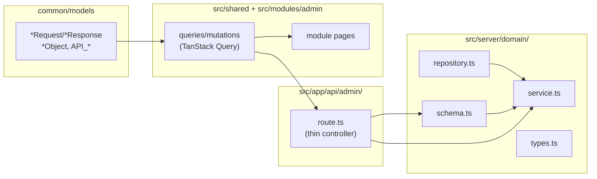

# Phase 1 — Admin Implementation Plan

## Thứ tự build

```
1.1 Admin Shell    → 1.2 Categories → 1.5 Toppings
                   → 1.3 Drinks (cần categories + toppings)
                   → 1.4 Products (cần categories)
                   → 1.6 Orders → 1.7 Staff → 1.8 Settings → 1.9 Dashboard
```

## Architecture flow (theo pattern Phase 0)



---

## 1.1 Admin Shell & Navigation

**Mục tiêu:** Layout có sidebar + header dùng chung cho mọi trang `/admin/*`.

### Files cần tạo/sửa

- [`src/modules/admin/layouts/index.tsx`](src/modules/admin/layouts/index.tsx) — Replace `AdminShellLayout` hiện tại: sidebar collapse + header + breadcrumb slot
- [`src/app/(admin)/admin/layout.tsx`](src/app/(admin)/admin/layout.tsx) — Wrap bằng `AdminShellLayout` (hiện chỉ có RBAC guard)
- Tạo các Next.js page shells (chỉ re-export module page):
  - `src/app/(admin)/admin/page.tsx` ← đã có, wire sang module
  - `src/app/(admin)/admin/categories/page.tsx`
  - `src/app/(admin)/admin/drinks/page.tsx`
  - `src/app/(admin)/admin/products/page.tsx`
  - `src/app/(admin)/admin/orders/page.tsx`
  - `src/app/(admin)/admin/orders/[id]/page.tsx`
  - `src/app/(admin)/admin/staff/page.tsx`
  - `src/app/(admin)/admin/settings/page.tsx`

**Sidebar nav items:**

| Label | Route |
|-------|-------|
| Dashboard | `/admin` |
| Danh mục | `/admin/categories` |
| Đồ uống | `/admin/drinks` |
| Sản phẩm đóng gói | `/admin/products` |
| Đơn hàng | `/admin/orders` |
| Nhân viên | `/admin/staff` |
| Cài đặt | `/admin/settings` |

---

## 1.2 Categories

### Backend — `src/server/category/`

- `category.repository.ts` — `findAll(type?)`, `findById`, `create`, `update`, `delete` (soft check)
- `category.service.ts` — business logic, `AppError` nếu xóa category còn product
- `category.schema.ts` — Zod: `createCategorySchema`, `updateCategorySchema` (`name`, `type: ProductType`, `sortOrder?`)
- `category.types.ts` — server-only return types

### API Contract — `common/models/category/`

- `category-model.ts` — `CategoryObject`, `CreateCategoryRequest`, `UpdateCategoryRequest`
- `category-api-model.ts` — `API_ADMIN_CATEGORIES`, `API_ADMIN_CATEGORY_BY_ID`
- `index.ts` — barrel

### API Routes — `src/app/api/admin/categories/`

- `route.ts` — `GET` (list + `?type=DRINK|PACKAGED`), `POST`
- `[id]/route.ts` — `PATCH`, `DELETE`

### Shared Query/Mutation — `src/shared/`

- `queries/use-query-admin-categories.ts`
- `mutations/use-admin-category-mutations.ts` (create, update, delete)

### Module UI — `src/modules/admin/`

- `pages/admin-categories.page.tsx` — `Table` + phân tab DRINK | PACKAGED + `Dialog` form tạo/sửa

---

## 1.5 Toppings (trước Drinks vì Drinks dùng toppings)

### Backend — `src/server/topping/`

- `topping.repository.ts` — `findAll`, `create`, `update`, `softDelete`
- `topping.service.ts`
- `topping.schema.ts` — `name`, `price: Int`, `isActive?`
- `topping.types.ts`

### API Contract — `common/models/topping/`

- `topping-model.ts` — `ToppingObject`, `CreateToppingRequest`, `UpdateToppingRequest`
- `topping-api-model.ts` — `API_ADMIN_TOPPINGS`, `API_ADMIN_TOPPING_BY_ID`

### API Routes — `src/app/api/admin/toppings/`

- `route.ts` — `GET`, `POST`
- `[id]/route.ts` — `PATCH`, `DELETE`

### Shared + Module

- `queries/use-query-admin-toppings.ts`
- `mutations/use-admin-topping-mutations.ts`
- `pages/admin-toppings.page.tsx` — section trong `/admin/drinks` hoặc page riêng

---

## 1.3 Drinks (Đồ uống — `ProductType.DRINK`)

### Backend — `src/server/product/` (shared domain cho cả DRINK + PACKAGED)

- `product.repository.ts` — methods riêng: `findDrinks`, `findPackaged`, `findById`, `createDrink`, `createPackaged`, `updateProduct`, `toggleStatus`, `updateStock`
- `product.service.ts` — validate `categoryId` exists + type matches; cascade variants/toppings/skus
- `product.schema.ts` — `createDrinkSchema` (`name`, `categoryId`, `variants[{name,price}]`, `toppingIds[]`, `image?`, `description?`), `createPackagedSchema`, `updateProductSchema`
- `product.types.ts`

### API Contract — `common/models/product/`

- `product-model.ts` — `DrinkObject` (with `variants`, `toppings`), `PackagedObject` (with `skus`), request/response types
- `product-api-model.ts` — `API_ADMIN_DRINKS`, `API_ADMIN_DRINKS_BY_ID`, `API_ADMIN_PRODUCTS`, `API_ADMIN_PRODUCTS_BY_ID`

### API Routes

- `src/app/api/admin/drinks/route.ts` — `GET` (filter category, search), `POST`
- `src/app/api/admin/drinks/[id]/route.ts` — `GET`, `PATCH`
- `src/app/api/admin/drinks/[id]/status/route.ts` — `PATCH`

### Shared + Module

- `queries/use-query-admin-drinks.ts`, `use-query-admin-drink-detail.ts`
- `mutations/use-admin-drink-mutations.ts`
- `pages/admin-drinks.page.tsx` — `Table` + modal form (variants inline: S/M/L + giá, multi-select toppings)

---

## 1.4 Packaged Products (`ProductType.PACKAGED`)

Reuse `src/server/product/` (đã tạo ở 1.3).

### API Routes

- `src/app/api/admin/products/route.ts` — `GET`, `POST`
- `src/app/api/admin/products/[id]/route.ts` — `GET`, `PATCH`
- `src/app/api/admin/products/[id]/stock/route.ts` — `PATCH` (manual stock adjustment)

### Shared + Module

- `queries/use-query-admin-products.ts`
- `mutations/use-admin-product-mutations.ts`
- `pages/admin-products.page.tsx` — `Table` với cột tồn kho, `Badge` cảnh báo stock < 5, inline SKU management

---

## 1.6 Orders Management

### Backend — `src/server/order/`

- `order.repository.ts` — `findAll(filters)`, `findById`, `updateStatus`, `deductStock` (khi CONFIRMED)
- `order.service.ts` — validate transitions trạng thái, deduct stock khi `PRODUCT_ORDER` → `CONFIRMED`
- `order.schema.ts` — `updateOrderStatusSchema`
- `order.types.ts`

### API Contract — `common/models/order/`

- `order-model.ts` — `OrderObject`, `OrderItemObject`, `UpdateOrderStatusRequest`
- `order-api-model.ts` — `API_ADMIN_ORDERS`, `API_ADMIN_ORDER_BY_ID`, `API_ADMIN_ORDER_STATUS`

### API Routes

- `src/app/api/admin/orders/route.ts` — `GET` (filter: type, status, channel, date range)
- `src/app/api/admin/orders/[id]/route.ts` — `GET`, `PATCH` status

### Shared + Module

- `queries/use-query-admin-orders.ts`, `use-query-admin-order-detail.ts`
- `mutations/use-admin-order-mutations.ts`
- `pages/admin-orders.page.tsx` — filter tabs (Tất cả | Nước | Sản phẩm | Online | POS)
- `pages/admin-order-detail.page.tsx` — items, timeline trạng thái

---

## 1.7 Staff Management

### Backend — `src/server/staff/`

- `staff.repository.ts` — `findAll`, `create`, `update`, `resetPassword`
- `staff.service.ts` — chỉ tạo với `role: STAFF`; hash password cho reset
- `staff.schema.ts` — `createStaffSchema`, `updateStaffSchema`, `resetPasswordSchema`
- `staff.types.ts`

### API Contract — `common/models/staff/`

- `staff-model.ts` — `StaffObject`, request types
- `staff-api-model.ts`

### API Routes

- `src/app/api/admin/staff/route.ts` — `GET`, `POST`
- `src/app/api/admin/staff/[id]/route.ts` — `PATCH`
- `src/app/api/admin/staff/[id]/reset-password/route.ts` — `PATCH`

### Shared + Module

- `queries/use-query-admin-staff.ts`
- `mutations/use-admin-staff-mutations.ts`
- `pages/admin-staff.page.tsx`

---

## 1.8 Settings

**Lưu ý:** Cần thêm model `ShopSettings` vào `prisma/schema.prisma` + migration.

### Backend — `src/server/settings/`

- `settings.repository.ts` — `findOrCreate` (upsert singleton `id="default"`), `update`
- `settings.service.ts`
- `settings.schema.ts` — `updateSettingsSchema`
- `settings.types.ts`

### API Routes

- `src/app/api/admin/settings/route.ts` — `GET`, `PATCH`

### Shared + Module

- `queries/use-query-admin-settings.ts`
- `mutations/use-admin-settings-mutation.ts`
- `pages/admin-settings.page.tsx` — form đơn giản

---

## 1.9 Dashboard (làm cuối)

### Backend — `src/server/dashboard/`

- `dashboard.repository.ts` — raw queries: doanh thu hôm nay, đếm đơn, top 5 sản phẩm
- `dashboard.service.ts`
- `dashboard.types.ts`

### API Routes

- `src/app/api/admin/dashboard/stats/route.ts` — `GET`
- `src/app/api/admin/dashboard/top-products/route.ts` — `GET`

### Shared + Module

- `queries/use-query-admin-dashboard.ts`
- `pages/admin-dashboard.page.tsx` — stat cards + bảng đơn gần đây (replace placeholder)

---

## Prisma Migration cần thiết

Thêm `ShopSettings` model (cho 1.8) vào `prisma/schema.prisma`:

```prisma
model ShopSettings {
  id           String  @id @default("default")
  shopName     String
  address      String?
  phone        String?
  openTime     String?
  closeTime    String?
  baseShipping Int     @default(15000)
}
```

Sau đó chạy: `npx prisma migrate dev --name add_shop_settings`

---

## Definition of Done

- Admin login → CRUD đầy đủ categories, drinks, products, toppings
- Tạo được nhân viên mới với role STAFF
- Xem và đổi trạng thái đơn hàng
- Seed data: ≥ 3 categories, ≥ 10 đồ uống, ≥ 5 sản phẩm đóng gói
- `npm run lint:strict` + `check-types` pass
