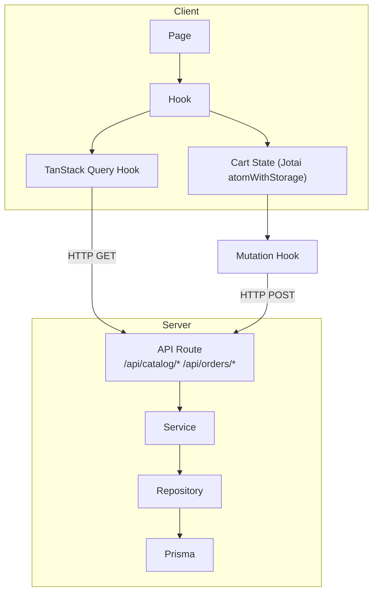

# Phase 2 — Customer Implementation Plan

## Architecture Flow



## Cart State Decision

Neither Zustand nor Jotai is installed. The project rule (`use-form-for-state.mdc`) explicitly states: **"Global app state (use Jotai atoms)"**. The plan uses Jotai with `atomWithStorage` for both `drinkCart` and `productCart`, which also provides localStorage persistence automatically.

- Install: `npm install jotai`
- Two separate atoms: `drinkCartAtom`, `productCartAtom`

---

## Step 1 — Foundation: API Base & Common Models

No dependencies. All subsequent steps rely on these types.

**Modify [`common/models/api-base.ts`](common/models/api-base.ts)** — add new base routes:
```ts
export const APIBaseRoutes = {
  AUTH: "/api/auth",
  ADMIN: "/api/admin",
  CATALOG: "/api/catalog",   // new
  ORDERS: "/api/orders",     // new
  SHOP: "/api/shop",         // new
} as const;
```

**Create `common/models/catalog/`** — public catalog types:
- `catalog-model.ts` — `PublicDrinkObject` (with `variants[]`, `toppings[]`), `PublicProductObject` (with `skus[]`), `PublicCategoryObject`, request/response pairs
- `catalog-api-model.ts` — `API_CATALOG_CATEGORIES`, `API_CATALOG_DRINKS`, `API_CATALOG_DRINK_DETAIL`, `API_CATALOG_PRODUCTS`, `API_CATALOG_PRODUCT_DETAIL`, `API_SHOP_SETTINGS`

**Extend `common/models/order/`** — customer order creation types:
- Add `CreateDrinkOrderRequest`, `CreateProductOrderRequest`, `PublicOrderObject`, `API_CREATE_DRINK_ORDER`, `API_CREATE_PRODUCT_ORDER`, `API_PUBLIC_ORDER`

---

## Step 2 — Server: Public Catalog APIs

**Extend existing server domains** (add public-facing service methods):

- [`src/server/category/category.service.ts`](src/server/category/category.service.ts) — add `listPublicCategories(type?)` filtering `isActive: true`
- [`src/server/product/product.service.ts`](src/server/product/product.service.ts) — add:
  - `listPublicDrinks(categorySlug?)` — active drinks + variants + toppings
  - `getPublicDrinkBySlug(slug)` — throws `AppError("Drink not found", 404)`
  - `listPublicProducts(categorySlug?)` — active packaged products + skus (stock > 0)
  - `getPublicProductBySlug(slug)`

**New API routes** (no `requireRole` — public):

| Route file | Handler |
|---|---|
| `src/app/api/catalog/categories/route.ts` | `GET` → `listPublicCategories` |
| `src/app/api/catalog/drinks/route.ts` | `GET` → `listPublicDrinks` |
| `src/app/api/catalog/drinks/[slug]/route.ts` | `GET` → `getPublicDrinkBySlug` |
| `src/app/api/catalog/products/route.ts` | `GET` → `listPublicProducts` |
| `src/app/api/catalog/products/[slug]/route.ts` | `GET` → `getPublicProductBySlug` |
| `src/app/api/shop/settings/route.ts` | `GET` → existing `getSettings()` (reuse) |

Pattern: same thin controller as admin routes, omit `requireRole`.

---

## Step 3 — Server: Order Creation & Tracking APIs

**Extend [`src/server/order/`](src/server/order/):**
- `createDrinkOrder(input)` — creates `DRINK_ORDER`, channel `ONLINE`, optional `userId`
- `createProductOrder(input)` — creates `PRODUCT_ORDER`, validates stock server-side
- `getPublicOrder(id, phone)` — returns order only if `customerPhone` matches (guest access)

**New Zod schemas** in `src/server/order/order.schema.ts`:
- `createDrinkOrderSchema` — customerName, phone, items (productId, variantId, toppingIds[], quantity, options{sugar,ice}, note), fulfillment, deliveryAddress?, paymentMethod
- `createProductOrderSchema` — customerName, phone, address, items (productId, skuId, quantity), paymentMethod

**New API routes:**

| Route file | Handler |
|---|---|
| `src/app/api/orders/drinks/route.ts` | `POST` → `createDrinkOrder` (optional auth via `getSessionUser`) |
| `src/app/api/orders/products/route.ts` | `POST` → `createProductOrder` |
| `src/app/api/orders/[id]/public/route.ts` | `GET` → `getPublicOrder(id, phone)` |

---

## Step 4 — TanStack Query & Mutation Hooks

Located in `src/shared/queries/` and `src/shared/mutations/`. Pattern: same as existing admin hooks.

**New query hooks:**
- `use-query-catalog-categories.ts` → `useQueryCatalogCategories(type?)`
- `use-query-catalog-drinks.ts` → `useQueryCatalogDrinks(categorySlug?)`
- `use-query-catalog-drink-detail.ts` → `useQueryCatalogDrinkDetail(slug)`
- `use-query-catalog-products.ts` → `useQueryCatalogProducts(categorySlug?)`
- `use-query-catalog-product-detail.ts` → `useQueryCatalogProductDetail(slug)`
- `use-query-shop-settings.ts` → `useQueryShopSettings()`
- `use-query-public-order.ts` → `useQueryPublicOrder(id, phone, { refetchInterval: 30_000 })`

**New mutation hooks:**
- `use-create-drink-order-mutation.ts` → `useCreateDrinkOrderMutation()`
- `use-create-product-order-mutation.ts` → `useCreateProductOrderMutation()`

---

## Step 5 — Customer Shell Layout (2.1 foundation)

**Replace stub in [`src/modules/customer/layouts/index.tsx`](src/modules/customer/layouts/index.tsx)** with `CustomerShellLayout`:
- Header: logo (shop name from `useQueryShopSettings`), nav links (`/order`, `/shop`), cart icon badges (drink count, product count from Jotai atoms)
- Footer: address, phone, open hours from shop settings

**Wire [`src/app/(customer)/layout.tsx`](src/app/(customer)/layout.tsx):**
```ts
import { CustomerShellLayout } from "@/modules/customer/layouts";
export default function CustomerLayout({ children }) {
  return <CustomerShellLayout>{children}</CustomerShellLayout>;
}
```

---

## Step 6 — Homepage (2.1)

**Replace [`src/modules/customer/pages/customer-home.page.tsx`](src/modules/customer/pages/customer-home.page.tsx)**:
- Hero section with two CTA buttons: "Order Drinks" (`/order`) + "Shop Products" (`/shop`)
- "Popular Drinks" section — top items from `useQueryCatalogDrinks` (first 6)
- "Featured Products" section — from `useQueryCatalogProducts` (first 4)

**Wire [`src/app/(customer)/page.tsx`](src/app/(customer)/page.tsx):**
```ts
import { CustomerHomePage } from "@/modules/customer/pages";
export default function Page() { return <CustomerHomePage />; }
```

---

## Step 7 — Catalog Pages (2.3 + 2.6)

**Drink menu page** (`/order`) — `customer-order.page.tsx`:
- Sidebar: category filter chips from `useQueryCatalogCategories({ type: "DRINK" })`
- Grid: `DrinkCard` components, click → `DrinkOptionsSheet` (Sheet component)
- `DrinkOptionsSheet` — select variant (S/M/L), toppings (checkboxes), sugar %, ice level, note; "Add to Cart" button updates `drinkCartAtom`

**Packaged shop page** (`/shop`) — `customer-shop.page.tsx`:
- Grid: `ProductCard`, click → `ProductDetailSheet`
- `ProductDetailSheet` — `SkuSelector` (radio for 250g/500g), quantity, "Out of Stock" if `stock = 0`; "Add to Cart" updates `productCartAtom`

**New app routes:**
- `src/app/(customer)/order/page.tsx` → `CustomerOrderPage`
- `src/app/(customer)/shop/page.tsx` → `CustomerShopPage`

---

## Step 8 — Cart State + Cart Pages (2.4)

**Install Jotai:** `npm install jotai`

**Create `src/modules/customer/hooks/use-drink-cart.ts`:**
- `drinkCartAtom` — `atomWithStorage<DrinkCartItem[]>("drink-cart", [])`
- `DrinkCartItem` = `{ id, productId, productName, variantId, variantName, toppingIds, toppingNames, sugar, ice, note, unitPrice, quantity }`
- Returns: `{ items, addItem, removeItem, updateQuantity, clearCart, subtotal, itemCount }`

**Create `src/modules/customer/hooks/use-product-cart.ts`:** same pattern with `ProductCartItem`.

**Cart pages:**
- `customer-drink-cart.page.tsx` — list items, +/- quantity, remove, subtotal + shipping fee, "Checkout" → `/checkout/drinks`
- `customer-product-cart.page.tsx` — same for products

**New app routes:**
- `src/app/(customer)/cart/drinks/page.tsx`
- `src/app/(customer)/cart/products/page.tsx`

---

## Step 9 — Checkout Flows (2.5 + 2.7)

**Drink checkout** — `customer-drink-checkout.page.tsx`:
- `useDrinkCheckout` hook — Zod schema for `{ customerName, phone, fulfillment (DELIVERY/PICKUP), deliveryAddress?, paymentMethod (COD/BANK_TRANSFER) }`
- `FulfillmentSelector` component — radio toggle (Delivery / Pickup)
- On submit: call `useCreateDrinkOrderMutation`, clear `drinkCartAtom`, redirect to `/orders/[id]`
- Shipping fee: `DELIVERY` → `shopSettings.baseShipping`, `PICKUP` → 0

**Product checkout** — `customer-product-checkout.page.tsx`:
- `useProductCheckout` hook — Zod schema for `{ customerName, phone, address, paymentMethod }`
- On submit: call `useCreateProductOrderMutation`, clear `productCartAtom`, redirect to `/orders/[id]`

**New app routes:**
- `src/app/(customer)/checkout/drinks/page.tsx`
- `src/app/(customer)/checkout/products/page.tsx`

---

## Step 10 — Order Tracking (2.8)

**Page** `customer-order-tracking.page.tsx` at `/orders/[id]`:
- Uses `useQueryPublicOrder(id, phone, { refetchInterval: 30_000 })`
- Phone passed via URL query param `?phone=...` (set during checkout redirect)
- Timeline component showing status progression: PENDING → CONFIRMED → PREPARING → READY → COMPLETED
- Status badges with color: pending=yellow, preparing=blue, ready=green, completed=gray, cancelled=red

**New app route:** `src/app/(customer)/orders/[id]/page.tsx`

---

## Step 11 — Customer Account (2.9 — optional)

Auth infrastructure already exists (`/api/auth/*`, `getSessionUser`).

- `customer-account.page.tsx` — profile info (name, phone, email), update form
- `customer-order-history.page.tsx` — list of orders for logged-in user (query `GET /api/orders` with userId filter, or new endpoint)
- Guest checkout continues to work without account

**New app routes:**
- `src/app/(customer)/account/page.tsx`
- `src/app/(customer)/account/orders/page.tsx`

---

## Files Summary by Layer

### `common/models/` (new)
- `catalog/catalog-model.ts`, `catalog-api-model.ts`, `catalog/index.ts`
- Extend `order/order-model.ts` + `order-api-model.ts`
- Modify `api-base.ts`

### `src/server/` (extend existing)
- `category/category.service.ts` + `category.repository.ts`
- `product/product.service.ts` + `product.repository.ts`
- `order/order.service.ts` + `order.repository.ts` + `order.schema.ts`

### `src/app/api/` (new routes)
- `catalog/categories/route.ts`, `catalog/drinks/route.ts`, `catalog/drinks/[slug]/route.ts`
- `catalog/products/route.ts`, `catalog/products/[slug]/route.ts`
- `shop/settings/route.ts`
- `orders/drinks/route.ts`, `orders/products/route.ts`, `orders/[id]/public/route.ts`

### `src/shared/queries/` (new)
- 7 new query hooks

### `src/shared/mutations/` (new)
- 2 new mutation hooks

### `src/modules/customer/` (build out)
- `layouts/customer-shell-layout.tsx`
- `hooks/use-drink-cart.ts`, `use-product-cart.ts`, `use-drink-checkout.ts`, `use-product-checkout.ts`
- `pages/` — 8 new pages
- `components/` — `drink-card.tsx`, `drink-options-sheet.tsx`, `product-card.tsx`, `product-detail-sheet.tsx`, `sku-selector.tsx`, `fulfillment-selector.tsx`, `order-status-timeline.tsx`

### `src/app/(customer)/` (new route wrappers)
- `page.tsx` (replace), `order/page.tsx`, `shop/page.tsx`, `cart/drinks/page.tsx`, `cart/products/page.tsx`, `checkout/drinks/page.tsx`, `checkout/products/page.tsx`, `orders/[id]/page.tsx`, `account/page.tsx`, `account/orders/page.tsx`
